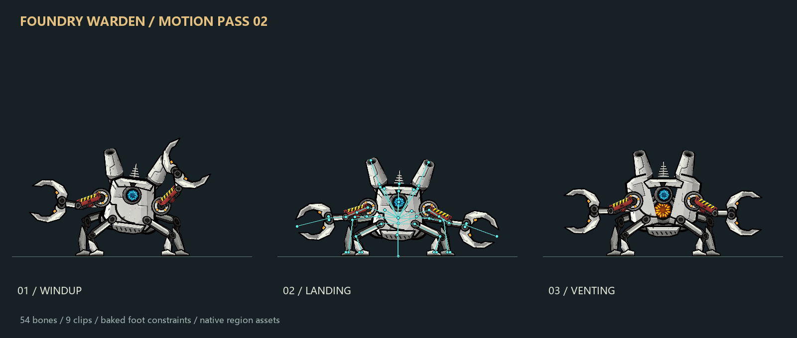

# Foundry Warden boss animation assets

An industrial, four-legged boss concept with hydraulic pincers, alternating mortar barrels, and an armored furnace core. The pack includes finished region artwork and nine authored skeletal animations.

**This contribution is an animation/design asset pack. Enemy registration, server AI, collision/damage behavior, and networked gameplay integration are follow-up work.**



[中文说明](README.zh-CN.md) · [Motion details](MOTION-V2.zh-CN.md) · [Recorded preview](motion-v2-showcase.mp4)

## Files

- `../../data/anim/foundry_warden/warden-motion-v2.json`: 54 bones, 49 slots, and nine clips in the region-based Spine JSON format supported by Ninslash.
- `warden-motion-v2.atlas` and `.png` in that directory: 26 regions in one 1024×1024 RGBA texture.
- `warden-motion-v2.combat.json`: proposed timing markers and effect sockets; an authoring sidecar, not an engine-executed configuration.
- `preview-motion-v2.html`: self-contained offline preview. Download/open it locally to compare the reference animation, scrub, slow playback, display bones, and disable effects.
- `source/`: pinned authoring inputs and the image-generation prompt. No image API is needed to rebuild the animations.
- `polish_animation.py`, `render_assets.py`, and `verify_motion.py`: authoring, independent evaluation/rendering, and exported-pose validation.

## Rebuild and verify

From the repository root, using Python 3.10 or newer:

```sh
python -m pip install -r design/foundry-warden/requirements.txt
python design/foundry-warden/polish_animation.py
python design/foundry-warden/verify_motion.py
```

The authoring pass bakes at 60 Hz, then reduces keys with bounded positional, angular, and scale error. The exported animations include planted-foot IK results, toe roll, separate upper-body suspension, hydraulic links, overlapping secondary motion, contact holds, and independently animated luminous parts. Only ordinary translate/rotate/scale tracks and region attachments are required.

Native loading is covered by CTest when `NINSLASH_BUILD_TESTS=ON`:

```sh
cmake -S . -B build -DCLIENT=OFF -DNINSLASH_BUILD_TESTS=ON -DCMAKE_CXX_STANDARD=17
cmake --build build --config Release --target ninslash_test_foundry_warden
ctest --test-dir build -C Release -R '^foundry_warden_assets$' --output-on-failure
```

The test uses the game's real `CSpineReader`, validates bone/slot/atlas references and checks the engine-relative texture path. `verify_motion.py` evaluates 121 exported poses per clip, checks loop continuity and support-foot drift, and inspects visible geometry for floor penetration and preview clipping. Results are recorded in `motion-validation.json`.

## Integration notes

The preview's clip crossfades, particle effects, camera feedback, contact shadows, bloom, and scrolling floor are presentation features. Their timing and sockets are documented for a future client implementation. The native export contains the skeletal motion itself.

Ninslash's current animation evaluator wraps time with `fmod`; clamp single-shot clips to `duration - epsilon` when holding their last pose. The walk clip is in place: entity movement should remain server-controlled, with playback speed matched to locomotion.

Artwork provenance, modifications, and CC BY-SA 3.0 attribution are in [ATTRIBUTION.md](ATTRIBUTION.md). The source texture was repainted with an OpenAI-compatible image service using the requested model identifier `gpt-image-2.5-sunburst`; the pinned input and prompt are included, without provider credentials or account configuration.
